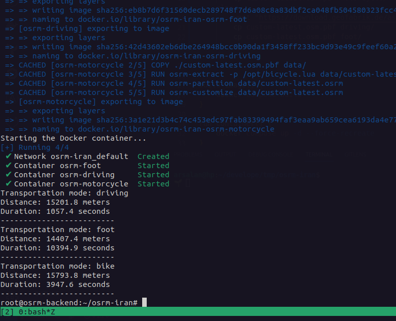

# OSRM Project Dockerfile with Custom Map

<p align="center">
    
</p>

This repository contains a docker-compose and instructions to set up an OSRM (Open Source Routing Machine) backend.

<p align="center">
    
</p>

## Prerequisites

- Docker: Make sure you have Docker installed on your system. You can download Docker from the official website: https://www.docker.com/get-started
- jq: Command-line JSON processor, Make sure you have jq installed on your system. `sudo apt install jq`

## Usage Method 1
1. Open a terminal or command prompt and navigate to the cloned repository directory.

2. Run the script by executing the following command:
    ```sh
    chmod +x run.sh
    ./run.sh
    ```
- Follow the prompts and provide the requested information

## Usage Method 2

1. Clone this repository:

    ```sh
    git clone https://github.com/arsalanses/osrm-custom.git
    ```

2. Navigate to the cloned repository:
    ```sh
    cd osrm-custom
    ```

3. Download the Iran map data:
    ```sh
    wget https://download.geofabrik.de/asia/iran-latest.osm.pbf -O custom-latest.osm.pbf
    cp custom-latest.osm.pbf driving/
    cp custom-latest.osm.pbf foot/
    cp custom-latest.osm.pbf motorcycle/
    ```

4. Build the Docker image:
    ```sh
    docker compose build
    ```
- This will build the Docker image using the provided Dockerfile and the downloaded Iran map data.

5. Run the Docker container:
    ```sh
    docker compose up -d
    ```

- This will start the OSRM backend server and expose it on ports 5000-5002 of your local machine.

6. Access the OSRM API:
- You can now access the OSRM API by making requests to http://localhost:5000. For example, you can try the following request in your browser:
    ```sh
    curl -s "http://127.0.0.1:5000/route/v1/driving/51.42838,35.80697;51.42088,35.68590?steps=false" | jq
    ```
- This will return a route between the coordinates (51.42838, 35.80697) and (51.42088, 35.68590) in JSON format.

7. Customize and explore:
- Feel free to customize the Dockerfile and explore the various features and options provided by OSRM. You can refer to the official OSRM documentation for more details: https://github.com/Project-OSRM/osrm-backend
